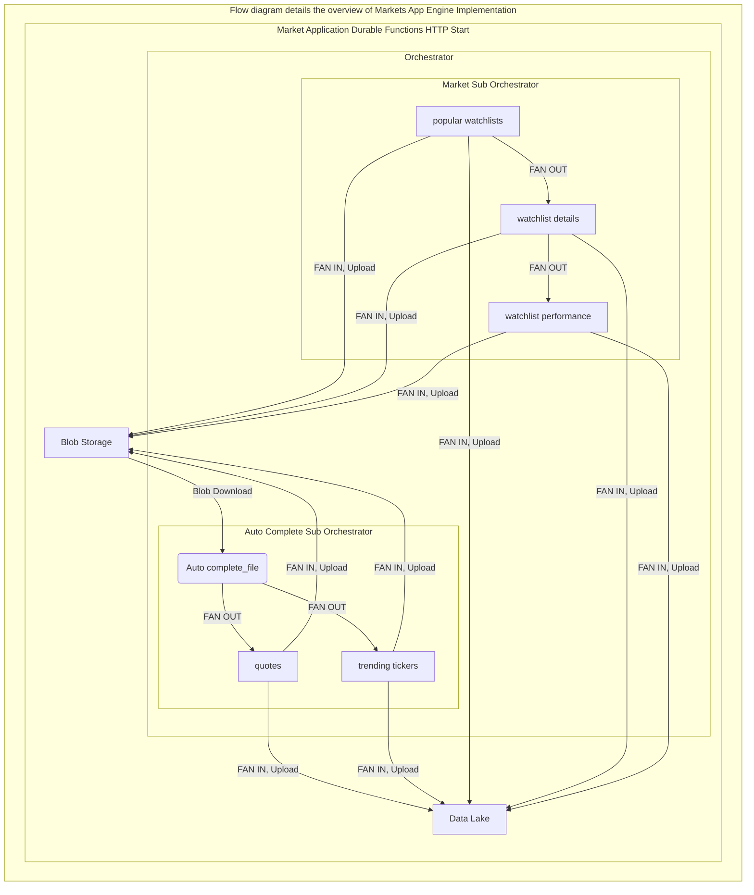

# Market Finance- Markets Application 
## 1. Local System Setup
```
# Check for python version 3.7 or greater
python --version

# Make sure Azure CLI is installed
az --version

# Make sure visual studio code is installed
code --version

# Make sure Azure Function Core Tools are installed
func --version

# Run az login to sign into Azure 
az login

# Turn on the param-persit option, so the varibles are automatically stored
az config param-persit on
```

## 2. Establish Global variables for Azure CLI
```
# Define the region for Application services
$service_location= <define your server location>

# Define the resource group used
$resource_group_name = <define your resource group name>

# Define the email user name for admin access 
$user_email= <define your user email address>

# Define the Blob's production container name
$abs_container_name= <define your blob storage production container name> 

# Define the Blob's archive container name
$abs_archive_container_name= <define your blob storage archive container name>

# Extract the blob storage account Id through Azure CLI
$storage_acct_id=$(az storage account show --name $storage_acct_name --resource-group $resource_group_name --query 'id' --output tsv)

# Extract the blob storage account key through Azure CLI
$storage_acct_key1=$(az storage account keys list --resource-group 
$resource_group_name --account-name $storage_acct_name --query [0].value --output tsv)

# Define the production Data Lake 
$adls_acct_name= <define your datalake account name> 
$fsys_name= <define your file root name>
$dir_name= <sub directory>

# Extract the datalake storage account key through Azure CLI
$adls_acct_key1=$(az storage account keys list --resource-group $resource_group_name --account-name $adls_acct_name --query [0].value --output tsv)

# Define the key vault name
$key_vault_name= <define your key vault name>

# Define the blob secret name
$abs_secret_name= <define your blob storage secrets name>

# Define the Data Lake secret name
$adls_secret_name= <define your data lake storage secrets name>

# Define the function application name
$funcapp_name= marketsApp
```

## 3. Create a new repossitory in Github
```
# git clone to the project root 
git clone <url>
```

## 4. Create a Azure function app
```
# Create a function project in the desired folder
# Make sure you are in the right folder directory 
func init marketsApp --python

# Create Python virtual environment 
python -m venv .venv

# Activate Python virtual environment
..venv\Scripts\activate

# Install the requried packages
pip install -r requirements.txt
``` 

## 5. Configure host.json file
```
# Open the host.json file and add function Time out limit
## Set to 3 hours
{
    "functionTimeout": "03:00:00"
}
```
## 6. Configure the local.settings.json file
```
# Open the local.settings file and define the following
{
    "ABS_SECRET_NAME": "abs-access-key1" <define your blob secret name stored in the secret valult>,
    "ADLS_SECRET_NAME": "adls-access-key1" <define your data lake secret name stored in the secret vault> ,
    "KEY_VAULT_NAME": "kvmarketfinance" <define your key vault name>,
    "X_RAPIDAPI_HOST": "x-rapidapi-host" <define your X_RAPIDAPI_HOST name>,
    "X_RAPIDAPI_KEY": "x-rapidapi-key <define your X_RAPIDAPI_KEY>"
}
```
## 7. Create Azure function App on Azure portal
```
# Create Function app
## Basic
subscription= <define your Azure subscription>
resouces_group= <define your resource group>
function_app_name= <define your function app name>
publish= 'code'
Runtime_stack= python
region= 'australiaEast'

## Hosting
storage_account_name= <define your blob storage account name>
operating_system= 'linux'
plan_type= 'App service plan'
linux_plan= <define your app service plan name>
sku_and_size= <select based on the app service plan>

# follow default settings for other sections
## Create
```

## 8. Setup and Configure variables for Azure function environment
```
az functionapp config appsettings set --name $funcapp_name --resource-group $resource_group_name --settings "KEY_VAULT_NAME=kvmarketfinance"
az functionapp config appsettings set --name $funcapp_name --resource-group $resource_group_name --settings "ABS_SECRET_NAME=abs-access-key1"
az functionapp config appsettings set --name $funcapp_name --resource-group $resource_group_name --settings "ADLS_SECRET_NAME=adls-access-key1"
az functionapp config appsettings set --name $funcapp_name --resource-group $resource_group_name --settings "X_RAPIDAPI_HOST= x-rapidapi-host"
az functionapp config appsettings set --name $funcapp_name --resource-group $resource_group_name --settings "X_RAPIDAPI_KEY= x-rapidapi-key"
```
## 9. Azure functions App role assigments for all the service such as blob storage, DataLake and keyvault
```
az functionapp identity assign --resource-group $resource_group_name --name $funcapp_name
$func_principal_id=$(az resource list --name $funcapp_name --query [*].identity.principalId --output tsv)
$kv_scope=$(az resource list --name $key_vault_name --query [*].id --output tsv)
az keyvault set-policy --name $key_vault_name --resource-group $resource_group_name --object-id $func_principal_id --secret-permission get list set
az role assignment create --assignee $func_principal_id --role 'Key Vault Contributor' --scope $kv_scope
az role assignment create --assignee $func_principal_id --role 'Storage Blob Data Contributor' --resource-group  $resource_group_name
az role assignment create --assignee $func_principal_id --role 'Storage Queue Data Contributor' --resource-group  $resource_group_name
```
## 10. Setup CI/CD for Azure function application
```
# Deployment center for commonApp
source= 'Github'
sign_in= <define your github username and password>
organisation= <define your organisation name>
repository= <define your repository>
branch= main
build_povider= 'GitHub Actions'
Runtime_stack= python
Version= Python 3.8
```
## 11. Check the configuration of the Azure function Application
```
# CommonApp configuration
# Application settings 
# Name value and source of 
# ABS_SECRET_NAME, ADLS_SECRET_NAME, X_RAPIDAPI_HOST, X_RAPID_API_KEY are
# referencing the key vault, if not add it manually
click edit, change and save
for value
@Microsoft.KeyVault(SecretUri=https://<key_vault_name>.vault.azure.net/secrets/<secret_name>/<version>)
```
## 12. Common Application Implementation Overview

### 12.1 Activities
####  Quotes
####  Trending tickers
####  Popular watchlists
####  Watchlist details
####  Watchlist performance

### 12.2 DurableFunction Http 
### 12.3 Orchestrator
#### Auto Complete
#### Popular Watchlist
### 12.4 Shared


# 13. Git push and Deploy
```
# commit the changes and push 
git push
```